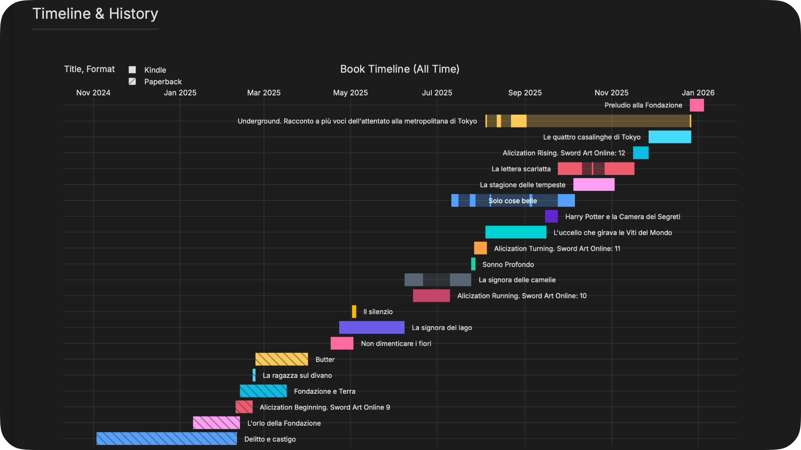
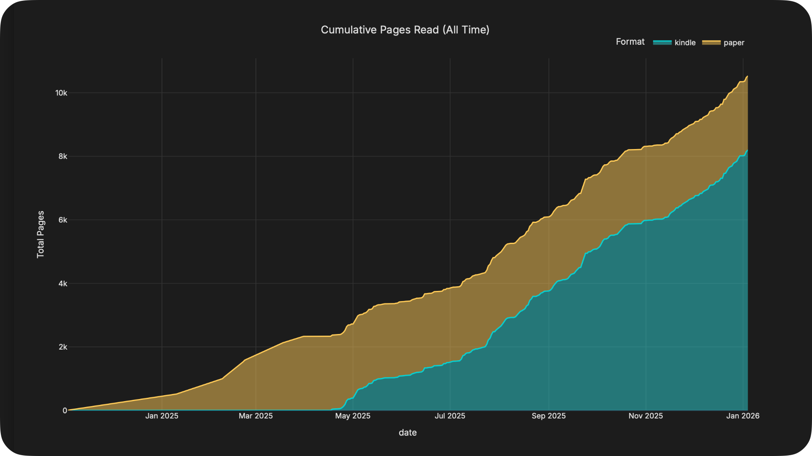
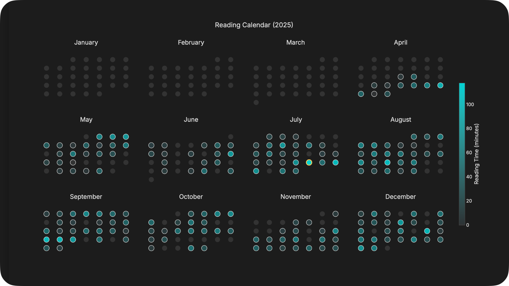
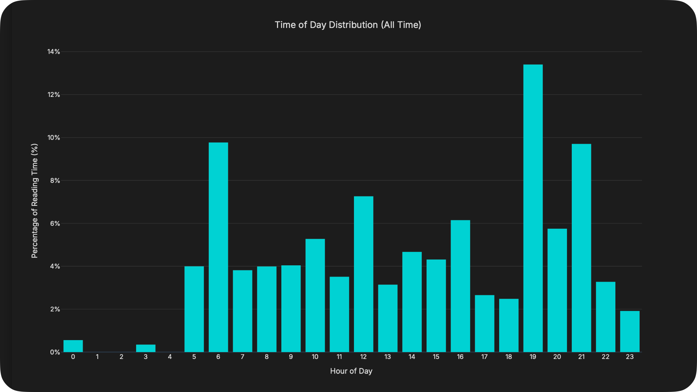

# Kograph Local

Kograph Local is a **Streamlit-based dashboard** that visualizes your **Koreader reading statistics**, **Paper Books history**, and **Audio Books history**. It generates an interactive, filterable web interface with detailed analytics, timelines, and trends.

## Features

-   **Interactive Dashboard**: Filter data by Year and Format (Ebook, Paperback, Audiobook).
-   **Multi-Source Data**:
    -   **Koreader**: Automatically syncs with `data/statistics.sqlite3` from your connected device.
    -   **Paper Books**: Integrates `data/paper_books.csv` to track physical reading history.
    -   **Audio Books**: Integrates `data/audio_books.csv` to track audiobook history.
-   **Rich Visualizations** (Plotly):
    -   **Book Timeline**: Gantt-style view of all books read, with accurate start/end dates.
    -   **Activity Patterns**: Weekly hours and Time of Day distribution.
    -   **Reading Calendar**: Monthly calendar grid highlighting reading intensity.
    -   **Streaks**: Analysis of reading streaks (Current, Longest, Daily Distribution).
    -   **Cumulative Pages**: Stacked area chart showing total pages read over time.
    -   **Books Completed**: Bar chart showing books finished per month.
-   **Responsive Design**: Dark-themed dashboard optimized for desktop viewing.

## Showcase

| Book Timeline | Cumulative Growth |
|:---:|:---:|
|  |  |

| Reading Calendar | Time Distribution |
|:---:|:---:|
|  |  |

## Setup

1.  **Requirements**:
    -   Python 3.9+
    -   Install dependencies:
        ```bash
        pip install -r requirements.txt
        ```

2.  **Data Setup**:
    -   **Kindle**: Connect your Kindle. The script looks for `statistics.sqlite3` in `/Volumes/Kindle/koreader/settings/` and copies it to `data/`.
    -   **Paper Books**: Create `data/paper_books.csv` with the following columns:
        | title | authors | pages | start_date | end_date | language |
        | --- | --- | --- | --- | --- | --- |
        | The Great Gatsby | F. Scott Fitzgerald | 180 | 2024-01-01 | 2024-01-10 | en |
    -   **Audio Books**: Create `data/audio_books.csv` (optional) to track listening sessions.
        -   **Format**: `progress` should be cumulative time listened (H:MM).
        
        | title | authors | date | end_time | progress |
        | --- | --- | --- | --- | --- |
        | Atomic Habits | James Clear | 2024-02-01 | 18:30 | 0:45 |
        | Atomic Habits | James Clear | 2024-02-02 | 20:15 | 1:30 |

## Usage

Run the Streamlit application:

```bash
streamlit run app.py
```

This will launch a local web server where you can explore your reading data.

The app will automatically:
1.  Load data from `data/statistics.sqlite3` (updating from Kindle if connected).
2.  Load paper books from `data/paper_books.csv` and audiobooks from `data/audio_books.csv`.
3.  Process reading sessions and calculate metrics.
4.  Display the interactive dashboard.

## Customization

-   **Theme**: Edit `THEME_COLORS` in `src/visuals.py` to change the color palette (default: Dark Mode with Cyan/Pink/Yellow accents).
-   **Session Threshold**: Adjust `gap_minutes` in `src/processing.py` (default: 5 min) to define how breaks are handled.

## Project Structure

-   `app.py`: Main Streamlit application entry point.
-   `src/db.py`: Database connection and file syncing.
-   `src/processing.py`: Data cleaning, sessionization, and metric calculation.
-   `src/visuals.py`: Plotly chart generation (Visualizer class).
-   `data/`: Directory for storing sqlite database and csv files.

## Notes

-   **Accuracy**: Detailed statistics (Streaks, Daily Patterns, etc.) currently rely mainly on Koreader and audiobook data, excluding synthetic sessions for paper books.
-   **Koreader Bugs**: The script automatically filters out "ghost" reading sessions (< 5 mins) and fixes zero-duration bugs common in Koreader stats.
